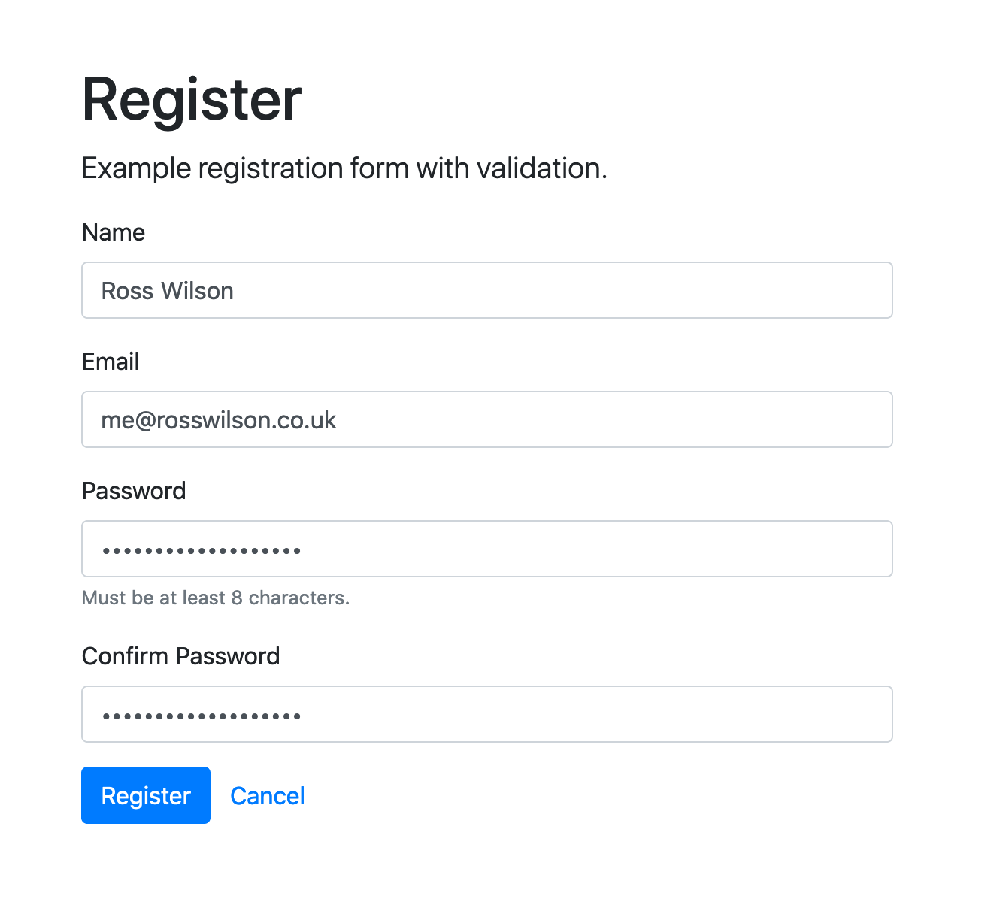
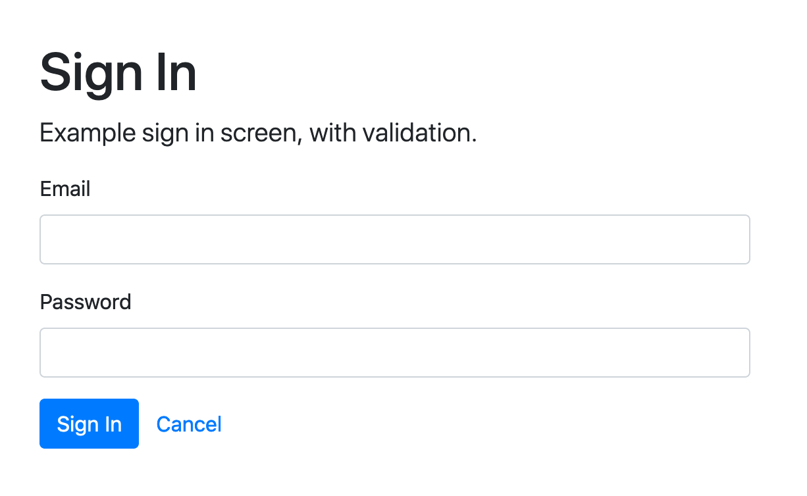

# Turret

[](https://github.com/rosswilson/turret/actions)

An open authentication and authorisation platform.

## Features

### Registration

<a href="./docs/screenshots/register.png">
  
</a>

- Form
- Validation
- Persistance to DynamoDB
  - Generating a UUID identifier for every user
  - Downcases email address for case-insensitive searching
- Issuing of a Single Sign On token (JWT), signed with a private key

### Sign In

<a href="./docs/screenshots/sign-in.png">
  
</a>

- Form
- Validation
- Defence against timing attacks when comparing password hashes
- Issuing of a Single Sign On token (JWT), signed with a private key

## Getting Started

Clone the repo:

```
git clone git@github.com:rosswilson/turret.git
cd turret
```

Follow [this AWS guide](https://docs.aws.amazon.com/amazondynamodb/latest/developerguide/DynamoDBLocal.DownloadingAndRunning.html) to run a local DynamoDB server.

Start the DynamoDB server:

`java -Djava.library.path=./DynamoDBLocal_lib -jar DynamoDBLocal.jar -sharedDb`

Create a `Users` table in DynamoDB:

```
aws --endpoint-url http://localhost:8000 dynamodb create-table \
    --table-name Users \
    --attribute-definitions AttributeName=Identifier,AttributeType=S \
    --key-schema AttributeName=Identifier,KeyType=HASH \
    --provisioned-throughput ReadCapacityUnits=5,WriteCapacityUnits=5
```

Generate a ECDSA key pair (used for signing tokens):

```
mkdir -p ./certs/signing
openssl ecparam -out certs/signing/ec_key.pem -name prime256v1 -genkey
openssl req -new -x509 -key certs/signing/ec_key.pem -out certs/signing/ec_cert.pem -days 365 -subj "/O=Turret/OU=Local Development"
```

Generate a self-signed certificate (used for HTTPS):

```
mkdir -p ./certs/tls
cd ./certs/tls
mkcert turret.localhost
```

Update your hosts file:

`echo "127.0.0.1 turret.localhost" | sudo tee -a /etc/hosts`

Use the default configuration, suitable for local development:

`cp .env.dist .env`

Install the npm dependencies:

`yarn`

Run the tests to confirm you're all set up:

`yarn test`

Run the local development server:

`yarn watch`

Open the application in your browser at [https://turret.localhost:3000](https://turret.localhost:3000)

## Architecture

TODO

## Testing

TODO

## Deployment

TODO

## License

Released under the MIT license.
